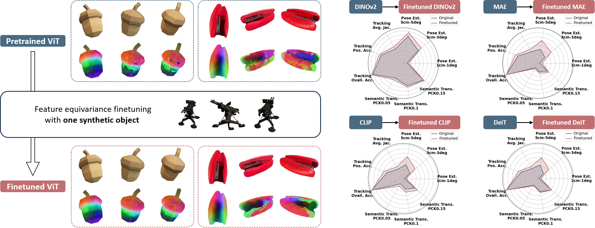

<h1 align="center">
Multiview Equivariance Improves 3D Correspondence Understanding with Minimal Feature Finetuning

 (ICLR 2025)
</h1>

<div align="center">
  <h3>
    <a href="https://qq456cvb.github.io">Yang You</a>, <a href="https://github.com/yixinliii">Yixin Li</a>, <a href="https://cs.stanford.edu/~congyue/">Congyue Deng</a>, <a href="https://yuewang.xyz/">Yue Wang</a>, <a href="https://geometry.stanford.edu/">Leonidas Guibas</a>
    <br><br>
    <a href='https://arxiv.org/abs/2411.19458'>
      
    </a>
    <a href='https://qq456cvb.github.io/3DCorrEnhance'>
      
    </a>
    <a href="https://huggingface.co/spaces/qq456cvb/3DCorrEnhance">
        
    </a>
    <br>
  </h3>
</div>

  

Finetuning feature equivariance on a synthetic object significantly enhances the Vision Transformer’s ability to generate better 3D feature correspondences across various objects. This improvement translates to superior performance in 3D tasks such as pose estimation, video tracking, and semantic correspondence.

You may also be interested in our previous work **[SparseDFF](https://helloqxwang.github.io/SparseDFF/)** (*ICLR 2024*), which employs DINO features for one-shot dexterous manipulation.

## Table of Contents
1. [Change Logs](#change-logs)
2. [Environment Setup](#environment-setup)
3. [Quick Start](#quick-start)
4. [Finetuning on Objaverse](#finetuning-on-objaverse)
   - [Data Preparation](#data-preparation)
   - [Run Finetuning](#run-finetuning)
5. [Evaluation](#evaluation)
   - [Data Preparation](#data-preparation-1)
   - [Run Evaluation](#run-evaluation)
6. [Acknowledgements](#acknowledgements)
7. [BibTeX](#bibtex)

## Change Logs
- **`2025/2/19`** - Uploaded other ViT-family models.
- **`2025/2/18`** - Uploaded two missing files for PF-PASCAL evaluation.
- **`2025/2/4`** - Uploaded more DINOv2 variants (DINOv2-Small/Large/Giant). Provide the environment requirements.
- **`2025/1/26`** - Uploaded pretrained models (DINOv2-Base) along with training/evaluation recipes.

## Huggingface Demo  
We provide a Huggingface demo at https://huggingface.co/spaces/qq456cvb/3DCorrEnhance.

## Environment Setup  
Our environment information can be found in `requirements.txt`. You can install them by:
```python
pip install -r requirements.txt
```

## Quick Start  
Our finetuned DINOv2-Small/Base/Large/Giant and other ViT-family models are available at [Huggingface](https://huggingface.co/qq456cvb/3DCorrEnhance/tree/main). To load DINOv2-Base, run:

```python
from finetune import FinetuneDINO
model = FinetuneDINO.load_from_checkpoint('https://huggingface.co/qq456cvb/3DCorrEnhance/resolve/main/dinov2_base.ckpt', r=4, backbone_size='base').eval().cuda()
```

To load other ViT models (e.g., CLIP), run:
```python
from finetune_timm import FinetuneTIMM
model = FinetuneTIMM.load_from_checkpoint('https://huggingface.co/qq456cvb/3DCorrEnhance/resolve/main/clip.ckpt', r=4, vit='clip').eval().cuda()
```

To extract descriptors for specific keypoints (a `Nx2` numpy array), use:

```python
import torch
from PIL import Image
import numpy as np

rgb = np.array(Image.open('/path/to/rgb.png'))
kps = ...  # N x 2 numpy array
rgb_input = torch.from_numpy(np.moveaxis((rgb / 255.).astype(np.float32), -1, 0)).cuda()
with torch.no_grad():
    kp_feats = model.get_feature(rgb_input[None], torch.from_numpy(kps).cuda()[None], normalize=True)[0]  # N x F torch tensor
```

To extract the entire feature map:

```python
import torch
from PIL import Image
import numpy as np

rgb = np.array(Image.open('/path/to/rgb.png'))
rgb_input = torch.from_numpy(np.moveaxis((rgb / 255.).astype(np.float32), -1, 0)).cuda()
with torch.no_grad():
    feat_img = model.get_feature_wo_kp(rgb_input[None], normalize=True)[0]  # H x W x F torch tensor
```

## Finetuning on Objaverse

### Data Preparation
To prepare the multi-view training data on Objaverse, first download the [Objaverse](https://huggingface.co/datasets/allenai/objaverse/tree/main/glbs) glbs (only a 10k subset is required, as defined in `data/10k.txt`). Then run `data_utils/render_objects.py` to render 10K randomly sampled Objaverse objects with `blenderproc`.

Your directory structure should look like this:

```
3DCorrEnhance/
└── data/
    └── 10k.txt
    └── obj_poses.npy
    └── objaverse/
        └── hf-objaverse-v1/
            └── glbs/
                ├── 000-000/
                ├── ...
                └── 000-159/
    └── objaverse_renderings/
```

### Run Finetuning
To finetune the DINOv2 base network, run:

```bash
finetune.py backbone=base
```

This will finetune DINOv2 Base and save checkpoints in the `checkpoints/` folder. For other DINOv2 variants, change the backbone type:

```bash
finetune.py backbone=large
```

For DINOv2 with registers, use:

```bash
finetune.py backbone=base reg=True
```

## Evaluation

### Data Preparation

For pose estimation, download the test data from [OnePose++](https://github.com/zju3dv/OnePose_Plus_Plus) and place it under `data/`. Your directory should look like this:

```
3DCorrEnhance/
└── data/
    └── sfm_output/
        └── outputs_softmax_loftr_loftr/
    └── lowtexture_test_data/
```

For video tracking evaluation, download the data from [TAP-Vid-DAVIS](https://github.com/google-deepmind/tapnet/tree/main/tapnet/tapvid) and place it under `data/`:

```
3DCorrEnhance/
└── data/
    ├── tapvid_davis_data_strided.pkl
    └── lowtexture_test_data/
```

For semantic transfer, download the [PF-PASCAL](https://www.di.ens.fr/willow/research/proposalflow/) dataset and place it under `data/`:

```
3DCorrEnhance/
└── data/
    └── PF-dataset-PASCAL/
        ├── Annotations/
        ├── JPEGImages/
        ├── test_pairs_pf_different_views.txt
        └── test_pairs_pf_same_views.txt
```

### Run Evaluation
To evaluate a checkpoint on all three tasks, run:

```bash
python evaluate.py --ckpt /path/to/ckpt --pose --tracking --transfer
```

## Acknowledgements  
Some code is adapted from [DINO-Tracker](https://dino-tracker.github.io/), [FiT3D](https://github.com/ywyue/FiT3D), and [Objaverse-XL](https://github.com/allenai/objaverse-xl). We thank these projects for their open-source contributions.

## BibTeX  
If you find our work helpful, please consider citing:

```
@misc{you2024multiviewequivarianceimproves3d,
      title={Multiview Equivariance Improves 3D Correspondence Understanding with Minimal Feature Finetuning}, 
      author={Yang You and Yixin Li and Congyue Deng and Yue Wang and Leonidas Guibas},
      year={2024},
      eprint={2411.19458},
      archivePrefix={arXiv},
      primaryClass={cs.CV},
      url={https://arxiv.org/abs/2411.19458}, 
}
```
